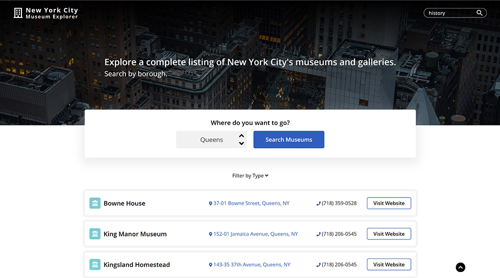

# NYC Museum Explorer
 

The project pulls data from <a href="https://dev.socrata.com/foundry/data.cityofnewyork.us/fn6f-htvy">New York City Open Data's Museums dataset (JSON)</a>, which contains information about all museums in New York. Use the web application to search and filter through results to find museum names, addresses, websites and contact information. 

Second project using JQuery and an API for the Fall 2019 Javascript course at Juno College. 

Try it out <a href="https://nycmuseums.netlify.com">here!</a>

## Features
- Fetching RESTful API data, sorting, and displaying it in a presentable way
- Demonstrated understanding of array methods to assign each museum type as a colour and icon 
- Creating a unique Google Maps search query for each museum and displaying it as a link

## To-do
- Add a Maps feature that pins the museum location on a map using coordinates provided by the museum API

